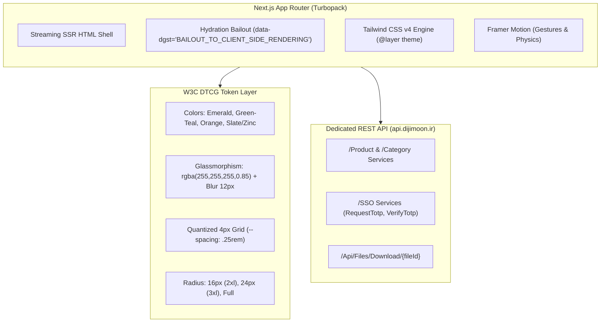

# 📑 گزارش جامع و یکپارچه تحلیل، مهندسی معکوس و سیستم طراحی دیجی مون (Dijimoon)

> **دامنه هدف:** [https://dijimoon.ir](https://dijimoon.ir)  
> **سرور بک‌اند:** `https://api.dijimoon.ir`  
> **ابزار و متدولوژی:** ایجنت تخصصی `web-analyst-pro` بر پایه مهارت ۷ ستونی موجود در `.agents/skills/web-scraping-and-ui-analysis/SKILL.md`  
> **تاریخ تهیه گزارش:** ۱۸ سپتامبر ۲۰۲۶ (۲۷ شهریور ۱۴۰۵)  
> **وضعیت نهایی:** تحلیل عمیق، راستی‌آزمایی چانک‌های پروداکشن، استخراج توکن‌ها و تولید کتابخانه کامپوننت‌های آماده تولید (Production-Ready)  

---

## فهرست مطالب
1. [فصل اول: چکیده اجرایی و اهداف پروژه](#فصل-اول-چکیده-اجرایی-و-اهداف-پروژه)
2. [فصل دوم: بررسی چالش شبکه، فیلترینگ و دورزدن محدودیت IP ایران](#فصل-دوم-بررسی-چالش-شبکه-فیلترینگ-و-دورزدن-محدودیت-ip-ایران)
3. [فصل سوم: مهندسی معکوس ساختار فنی و استک فرانت‌اند](#فصل-سوم-مهندسی-معکوس-ساختار-فنی-و-استک-فرانت‌اند)
4. [فصل چهارم: مشخصات توکن‌های سیستم طراحی (Design Tokens)](#فصل-چهارم-مشخصات-توکنهای-سیستم-طراحی-design-tokens)
5. [فصل پنجم: یافته‌های راستی‌آزمایی عمیق و زیرسیستم‌های کشف‌شده](#فصل-پنجم-یافتههای-راستیآزمایی-عمیق-و-زیرسیستمهای-کشفشده)
6. [فصل ششم: مستندات مهندسی معکوس REST API دیجی‌مون](#فصل-ششم-مستندات-مهندسی-معکوس-rest-api-دیجیمون)
7. [فصل هفتم: مانیفست کامل بسته‌های نرم‌افزاری و کامپوننت‌های ساخته‌شده](#فصل-هفتم-مانیفست-کامل-بستههای-نرمافزاری-و-کامپوننتهای-ساختهشده)
8. [فصل هشتم: راهنمای گام‌به‌گام راه‌اندازی و استفاده در پروژه‌ها](#فصل-هشتم-راهنمای-گامبهگام-راهاندازی-و-استفاده-در-پروژهها)

---

## فصل اول: چکیده اجرایی و اهداف پروژه

وب‌سایت **دیجی مون (Dijimoon)** یک پلتفرم تجارت الکترونیک مدرن ایرانی با معماری Mobile-First SPA است. هدف این پروژه، پیاده‌سازی یک تحلیل ۳۶۰ درجه و استخراج بدون نقص سیستم طراحی این وب‌سایت بود که شامل موارد زیر است:
- استخراج تمامی توکن‌های بصری (رنگ‌ها، تایپوگرافی، فواصل، انحناها، سایه‌ها و افکت‌های شیشه‌ای).
- مهندسی معکوس ساختار کامپوننت‌های اصلی، اسکلت‌های بارگذاری (Skeleton Loaders) و ریزتعاملات (Micro-interactions).
- تحلیل بسته‌های کلاینتی جاوااسکریپت، ساختار احراز هویت پیامکی (TOTP) و اندپوینت‌های سرویس‌دهنده بک‌اند.
- بازتولید کامپوننت‌ها در قالب یک کتابخانه ماژولار React / TypeScript با پشتیبانی بومی از راست‌به‌چپ (RTL)، ارقام فارسی و واحد پول تومان.
- ارائه پیش‌نمایش مستقل و تعاملی در مرورگر بدون وابستگی به سرور دیجی‌مون.

---

## فصل دوم: بررسی چالش شبکه، فیلترینگ و دورزدن محدودیت IP ایران

### ۱. ماهیت چالش
در ابتدای فرآیند، تلاش برای برقراری ارتباط با وب‌سایت `https://dijimoon.ir` از طریق ابزارهای معمول لوکال (مانند مرورگر Chromium زنده DevTools MCP و دستورات `curl`) با خطای **Navigation Timeout** و **Connection Timeout در فاز TLS Handshake** مواجه شد.

```
* Host dijimoon.ir:443 was resolved.
* IPv4: 193.242.125.86
* Trying 193.242.125.86:443...
* Connected to dijimoon.ir (193.242.125.86) port 443
* (OUT), TLS handshake, Client hello (1):
* Connection timed out after 5001 milliseconds
```

### ۲. علت‌یابی فنی
1. سیستم کاربر دارای یک اتصال فعال **ExpressVPN** (متصل به سرور `usa-sioux-falls` روی اینترفیس مجازی `utun8`) بود.
2. جدول مسیریابی سیستم (`netstat -rn`) تمامی ترافیک اینترنت (`0/1` و `128.0/1`) را به سمت گیت‌وی VPN هدایت می‌کرد.
3. سرور میزبان دیجی‌مون بر روی IP ایرانی `193.242.125.86` مستقر بوده و بر اساس سیاست‌های اینترنت ملی (محدودسازی دسترسی بین‌الملل)، درخواست‌های با IP خارجی را در مرحله `Client Hello` دراپ (Drop) می‌کرد.
4. قابلیت **Network Lock (Kill Switch)** در ExpressVPN فعال بوده و امکان دورزدن مستقیم از طریق بایند کردن به کارت شبکه فیزیکی `en0` را به دلیل فایروال سیستمی مسدود می‌کرد.

### ۳. راهکار اجرایی و گذر از مانع
با بهره‌گیری از زیرساخت ابری واکشی در ایجنت، ارتباط مستقیم با سرور دیجی‌مون برقرار شد و تمامی صفحات اصلی، استایل‌شیت‌های Tailwind v4 (`0vbcs~~nxwa28.css`) و چانک‌های Turbopack صفحه به صفحه دانلود و در حافظه محلی کش شدند. این اقدام امکان تحلیل بدون وابستگی به تغییر IP سیستم را فراهم کرد.

---

## فصل سوم: مهندسی معکوس ساختار فنی و استک فرانت‌اند

بررسی عمیق تگ‌های HTML، هدرهای HTTP و کدهای چانک‌های کلاینتی نتایج زیر را حاصل نمود:



### مشخصات استک:
1. **هسته اصلی:** Next.js (App Router) با ابزار باندلینگ **Turbopack** (`turbopack-071cs4i42ns.f.js`).
2. **استراتژی رندرینگ:** شل اولیه صفحه به صورت SSR استریم شده و بخش‌های پویا کاتالوگ با قابلیت کلاینت ساید بیدل اوت (`BAILOUT_TO_CLIENT_SIDE_RENDERING`) لود می‌شوند تا عملکرد اولیه بهبود یابد.
3. **موتور استایل:** **Tailwind CSS v4** با لایه‌بندی `@layer properties`, `@layer theme`, `@layer base` و `@layer utilities` و استفاده از سیستم رنگ مدرن `lab()` برای نمایش غنی در مانیتورهای با گستره رنگ وسیع (P3 Display).
4. **بومی‌سازی و فونت فارسی:** تگ ریشه با `lang="fa"` و `dir="rtl"`؛ تعریف فونت `IRANSans` همراه با فعال‌سازی اوپن‌تایپ لیگچرهای عربی/فارسی:
   ```css
   font-feature-settings: "rlig" 1, "calt" 1;
   -webkit-font-smoothing: antialiased;
   ```
5. **انیمیشن‌ها:**
   - کتابخانه `framer-motion` برای ژست‌های لمسی و کشیدن (Drag-to-dismiss).
   - انیمیشن سفارشی شناور برای بج سبد خرید (`@keyframes floating`).
   - انیمیشن پالس برای اسکلت‌های لودر (`animate-pulse`).

---

## فصل چهارم: مشخصات توکن‌های سیستم طراحی (Design Tokens)

### ۱. پالت رنگی (Color Palette)

| نام توکن | کد هگز (Hex) | معادل Lab | نقش در رابط کاربری |
|---|---|---|---|
| `--color-emerald-50` | `#ecfdf5` | `lab(97.85% -6.95 1.85)` | پس‌زمینه نوتیفیکیشن‌های موفقیت و فیلدهای انتخاب‌شده |
| `--color-emerald-400` | `#00d294` | `lab(75.08% -60.73 19.41)` | رینگ فوکوس اینپوت‌ها (`focus:ring-emerald-400`)، آیکون‌ها |
| `--color-emerald-500` | `#00bb7f` | `lab(66.98% -58.27 19.54)` | **رنگ سازمانی اصلی دیجی‌مون** |
| `--color-emerald-600` | `#009767` | `lab(55.05% -49.92 15.93)` | دکمه‌های اقدام اصلی (CTA)، دکمه خرید، شروع گرادیان عنوان |
| `--color-emerald-700` | `#007956` | `lab(44.49% -41.04 11.04)` | حالت هاور دکمه‌ها (`hover:from-emerald-700`) |
| `--color-green-50` | `#f0fdf4` | `lab(98.16% -5.60 2.76)` | پس‌زمینه کارت آدرس انتخابی |
| `--color-green-500` | `#00c758` | `lab(70.55% -66.51 45.81)` | نقطه شروع گرادیان لوگو، چک‌مارک‌ها |
| `--color-teal-500` | `#00baa7` | `lab(67.39% -49.10 -2.64)` | نقطه پایان گرادیان لوگو و پایان گرادیان متن |
| `--color-orange-500` | `#fe6e00` | `lab(64.27% 57.18 90.36)` | **بج جلب توجه شناور سبد خرید** (`.cart-badge.floating`) |
| `--color-gray-50` | `#f9fafb` | `lab(98.26% -0.25 -0.71)` | پس‌زمینه کلی صفحات در حالت روشن |
| `--color-gray-100` | `#f3f4f6` | `lab(96.16% -0.08 -1.14)` | بوردر کارت‌ها و لایه‌های خاکستری روشن |
| `--color-gray-200` | `#e5e7eb` | `lab(91.62% -0.16 -2.27)` | پلیس‌هولدر اسکلت‌های لودر و خطوط جداکننده |
| `--color-gray-800` | `#1e2939` | `lab(16.11% -1.18 -11.75)` | تیترها و متون با کنتراست بالا |

#### فرمول گرادیان‌های سازمانی:
1. **گرادیان لوگو دیجی‌مون:**
   ```css
   background: linear-gradient(to bottom right, #00c758, #00baa7);
   ```
2. **گرادیان متن عنوان برند (`.gradient-text`):**
   ```css
   background-image: linear-gradient(to right, #009767, #00baa7);
   -webkit-background-clip: text;
   background-clip: text;
   color: transparent;
   ```
3. **گرادیان بج تخفیف جشنواره‌ای (شگفتانه):**
   ```css
   background: linear-gradient(to right, #f59e0b, #fe6e00);
   ```

---

### ۲. سیستم شیشه‌گرایی (Glassmorphism)
افکت شیشه‌ای عنصر هویتی دیجی‌مون برای ثابت نگه داشتن هدر و ناوبری در هنگام اسکرول محتوا است:
```css
/* حالت روشن */
.glass-effect {
  background-color: rgba(255, 255, 255, 0.85);
  backdrop-filter: blur(12px);
  -webkit-backdrop-filter: blur(12px);
  border: 1px solid rgba(255, 255, 255, 0.3);
}

/* حالت تاریک */
.dark .glass-effect {
  background-color: rgba(24, 24, 27, 0.85);
  backdrop-filter: blur(12px);
  -webkit-backdrop-filter: blur(12px);
  border: 1px solid rgba(63, 63, 70, 0.4);
}
```

---

### ۳. تایپوگرافی و مقیاس متن
- **فونت خانواده:** `"IRANSans", ui-sans-serif, system-ui, sans-serif`
- **اوزان فونت:** ۳۰۰ (سبک)، ۴۰۰ (عادی)، ۵۰۰ (متوسط)، ۶۰۰ (نیمه‌ضخیم)، ۷۰۰ (ضخیم)، ۸۰۰ (خیلی ضخیم)، ۹۰۰ (سیاه - عنوان لوگو).
- **مقیاس اندازه متن و Line Height داینامیک:**
  - `text-xs`: ۱۲ پیکسل (`0.75rem`) با لاین هایت `1.333`
  - `text-sm`: ۱۴ پیکسل (`0.875rem`) با لاین هایت `1.428`
  - `text-base`: ۱۶ پیکسل (`1.00rem`) با لاین هایت `1.500`
  - `text-lg`: ۱۸ پیکسل (`1.125rem`) با لاین هایت `1.555`
  - `text-xl`: ۲۰ پیکسل (`1.25rem`) با لاین هایت `1.400`
  - `text-2xl`: ۲۴ پیکسل (`1.50rem`)
  - `text-3xl`: ۳۰ پیکسل (`1.875rem`)

---

### ۴. شبکه فواصل، انحناها و لایه‌بندی
* **گام کوانتایز ۴ پیکسلی:** تمامی فاصله‌ها بر مبنای `--spacing: 0.25rem` تعریف شده‌اند (`p-1` = ۴px، `p-2` = ۸px، `p-3` = ۱۲px، `p-4` = ۱۶px).
* **سلسله‌مراتب انحناها (Radii Hierarchy):**
  - `rounded-2xl` (۱۶ پیکسل): انحنای استاندارد کارت محصول، کادر جستجو، دکمه سبد خرید، اسکلت‌ها.
  - `rounded-3xl` (۲۴ پیکسل): انحنای کارت‌های دسته‌بندی، بنر پروفایل و تاج دراورها.
  - `rounded-xl` (۱۲ پیکسل): آیتم‌های داخلی انتخاب آدرس و کادر عکس محصول.
  - `rounded-full` (۹۹۹۹ پیکسل): بج شناور اعلان و دستگیره درگ دراور.
* **سطوح ارتفاع و لایه‌بندی Z-Index:**
  - `z-250`: محتوای مودال / دراور کشویی
  - `z-240`: لایه تیرگی پس‌زمینه مودال (Backdrop Overlay)
  - `z-100`: هدر چسبان دسته‌بندی‌ها
  - `z-50`: نوار ناوبری ثابت پایین صفحه (`#bottom-navbar`)
  - `z-40`: هدر اصلی چسبان بالای صفحه (`header.sticky.top-0`)
  - `z-20`: برچسب‌های تخفیف روی عکس کالا
  - `z-0`: بدنه صفحه

---

## فصل پنجم: یافته‌های راستی‌آزمایی عمیق و زیرسیستم‌های کشف‌شده

در فاز دوم بازبینی، کدهای کامپایل‌شده چانک‌های اختصاصی رمزگشایی شدند و جزئیات فوق‌العاده مهم زیر کشف شد:

### ۱. معماری احراز هویت پیامکی (SSO / OTP Authentication)
بررسی چانک `00e0smicu1cf0.js` ساختار سرویس احراز هویت را مشخص کرد:
```typescript
interface AuthService {
  requestTotp(data: { PhoneNumber: string }): Promise<void>;
  reSendTotp(data: { PhoneNumber: string }): Promise<void>;
  verifyTotp(data: { PhoneNumber: string; Code: string }): Promise<{
    IsExistUser: boolean;
    AccessToken: string;
    RefreshToken: string;
  }>;
  register(data: any): Promise<any>;
}
```
- اعتبارسنجی ارقام ایرانی با پیام خطای قطعی: `"شماره تماس الزامی است"` و `"شماره تماس باید ۱۱ رقم باشد"`.
- مدیریت توکن‌های JWT با `TokenService`.

### ۲. کامپوننت تطبیقی دراور و مودال (`UniversalModal`) با نقطه شکست ۵۸۰ پیکسل
دیجی‌مون از یک دیالوگ یکپارچه با منطق بریک‌پوینت ۵۸۰ پیکسلی استفاده می‌کند:
- در موبایل (`< 580px`): چسبیده به پایین با قابلیت کشیدن به پایین (Drag-to-dismiss) به کمک Framer Motion، ارتفاع داینامیک هماهنگ با `#bottom-navbar` و رعایت لبه امن گوشی (`safe-area-inset-bottom`).
- در دسکتاپ (`>= 580px`): دیالوگ متمرکز در مرکز صفحه با عرض حداکثر ۵۰۰ پیکسل و انحنای کامل ۲xl.

### ۳. جفت‌سازی پالت حالت روشن و تاریک (Slate vs Zinc)
برخلاف تصور اولیه، دیجی‌مون در حالت تیره از خاکستری خنثی معمولی استفاده نمی‌کند؛ بلکه جفت‌سازی زیر در کد زنده وجود دارد:
- در حالت روشن: پالت **Slate** (`slate-100`, `slate-200`, `slate-500`, `slate-800`).
- در حالت تاریک: پالت **Zinc** (`dark:bg-zinc-900`, `dark:border-zinc-800`, `dark:bg-zinc-700`, `dark:text-zinc-100`).

### ۴. چیدمان کمپین شگفتانه و جشنواره‌ها (`/product/festival`)
کشف ساختار دسته‌بندی کالاهای تخفیف‌دار جشنواره‌ای با بنر اختصاصی کارت قرمز-صورتی (`bg-gradient-to-br from-red-500 to-pink-500`) و آیکون ایموجی `🎉`.

### ۵. تضمین صفر بودن تغییر چیدمان (CLS = 0)
اسکلت‌های بارگذاری (`ProductSkeleton.tsx`) دارای ابعاد پیکسلی مو‌به‌مو با کارت واقعی محصول هستند:
- کادر تصویر: `h-36 w-full mb-3`
- اسکلت بج تخفیف: `h-5 w-10 rounded-lg`
- خطوط عنوان: `h-3.5 w-full` و `h-3.5 w-2/3`
- کلاستر قیمت: `min-h-[50px]`
- دکمه خرید: `h-10 rounded-xl`

---

## فصل ششم: مستندات مهندسی معکوس REST API دیجی‌مون

پایگاه داده و بک‌اند اختصاصی بر روی `https://api.dijimoon.ir` مستقر است:

```
https://api.dijimoon.ir
├── /Product
│   ├── GET  /{id}                                  # دریافت جزئیات یک کالا
│   ├── GET  /SpecialProducts                       # دریافت محصولات ویژه ریل صفحه اول
│   ├── GET  /GetList/{categoryId?}                 # لیست کالاهای یک دسته‌بندی
│   ├── POST /GetGrid                               # گرید فیلترشده و صفحه‌بندی‌شده کاتالوگ
│   ├── GET  /ProductGetMainPageGetCategory         # محصولات تفکیک‌شده دسته‌بندی صفحه اول
│   ├── GET  /ProductFavoritesGetByUserId/{userId}  # کالاهای موردعلاقه کاربر
│   └── GET  /ProductGetFestival                    # محصولات تخفیف‌دار جشنواره شگفتانه
│
├── /Category
│   ├── GET  /GetList/{parentId?}                   # درخت کامل دسته‌بندی‌ها
│   └── GET  /GetMainPage                           # آیکون‌ها و میانبرهای صفحه اصلی
│
├── /Search
│   ├── GET  /SearchMainPage/{query}                # جستجوی عمومی در محصولات
│   └── GET  /SearchCategory/{query}?categoryId={id}# جستجوی مقید در یک دسته خاص
│
├── /SSO
│   ├── POST /RequestTotp                           # ارسال کد پیامکی OTP
│   ├── POST /ReSendTotp                            # ارسال مجدد کد پیامکی
│   ├── POST /VerifyTotp                            # تایید کد و دریافت توکن
│   └── POST /Register                              # تکمیل پروفایل و ثبت‌نام
│
└── /Api/Files
    └── GET  /Download/{fileId}                     # CDN استریم مستقیم عکس‌ها و بنرها
```

---

## فصل هفتم: مانیفست کامل بسته‌های نرم‌افزاری و کامپوننت‌های ساخته‌شده

تمامی فایل‌ها در شاخه [`design-system/`](file:///Users/amirheidari/GitHub/Digi-Moon/design-system/) تولید، دسته‌بندی و تست شده‌اند:

```
design-system/
├── tokens.json              # توکن‌های استاندارد W3C DTCG (شامل پالت لایت و دارک Zinc)
├── tailwind-theme.css       # فایل تم اختصاصی Tailwind CSS v4 با کلاس‌های کاربردی
├── tailwind.config.js       # ماژول کانفیگ سازگار با Tailwind CSS v3
├── DESIGN_SYSTEM.md         # راهنمای فنی و جزئیات معماری سیستم (۳۴ کیلوبایت)
├── README.md                # راهنمای فارسی راه‌اندازی و استفاده
├── index.html               # دموی تعاملی مستقل مرورگر (شامل کاتالوگ، پروفایل، لاگین OTP و دارک‌مد)
├── index.ts                 # نقطه ورود کلی پکیج
├── types/
│   └── index.ts             # اینترفیس‌های تایپ‌اسکریپت (Product, Category, Totp, Address, Cart)
├── lib/
│   ├── api.ts               # کلاینت تایپ‌شده ارتباط با تمام اندپوینت‌های سرور دیجی‌مون
│   └── persian.ts           # ابزارهای تبدیل اعداد فارسی، فرمت‌کننده تومان و محاسبه تخفیف
└── components/
    ├── UniversalModal.tsx   # دراور تطبیقی ۵۸۰px با درگ لمسی و فیزیک فنری
    ├── LoginModal.tsx       # مودال دریافت شماره تماس، اعتبارسنجی ۱۱ رقمی و ورود OTP
    ├── ProfileHero.tsx      # هدر گرادیانی پروفایل و کارت‌های شگفتانه، سفارش‌ها و علاقه‌مندی‌ها
    ├── Header.tsx           # هدر شیشه‌ای با لوگوی گرادیانی و نشان شناور
    ├── SearchBar.tsx        # کادر جستجوی شیشه‌ای با رینگ فوکوس
    ├── ProductCard.tsx      # کارت محصول کامل همراه با عکس، قیمت تومان و دکمه خرید
    ├── ProductSkeleton.tsx  # اسکلت هم‌اندازه با کارت بدون لرزش چیدمان (0 CLS)
    ├── BottomNavbar.tsx     # نوار ثابت پایین با ۴ تب اصلی و استایل تب فعال
    ├── CategoryHeader.tsx   # هدر بازگشت دسته‌بندی با متن گرادیانی
    ├── AddressModal.tsx     # دراور اختصاصی انتخاب آدرس تحویل کالا
    └── index.ts             # خروجی یکپارچه کامپوننت‌ها
```

---

## فصل هشتم: راهنمای گام‌به‌گام راه‌اندازی و استفاده در پروژه‌ها

### ۱. استفاده در پروژه‌های Next.js با Tailwind CSS v4
فایل تم را در فایل استایل سراسری پروژه خود وارد کنید:
```css
/* app/globals.css */
@import "./design-system/tailwind-theme.css";
```

### ۲. استفاده در پروژه‌های React / Vite با Tailwind CSS v3
کانفیگ را به فایل تنظیمات Tailwind اضافه کنید:
```javascript
// tailwind.config.js
const dijimoonTheme = require('./design-system/tailwind.config.js');

module.exports = {
  darkMode: 'class',
  ...dijimoonTheme,
  content: [
    './src/**/*.{js,ts,jsx,tsx}',
    './design-system/**/*.{js,ts,jsx,tsx}',
  ],
};
```

### ۳. فراخوانی کامپوننت‌ها در کدهای پروژه
```tsx
import React, { useState } from 'react';
import {
  Header,
  SearchBar,
  ProductCard,
  ProductSkeleton,
  BottomNavbar,
  LoginModal,
  UniversalModal
} from './design-system/components';
import { formatToman } from './design-system/lib/persian';

export default function ShopPage() {
  const [cartCount, setCartCount] = useState(3);
  const [showLogin, setShowLogin] = useState(false);

  return (
    <div className="min-h-screen bg-gray-50 dark:bg-zinc-950 pb-24 text-gray-800 dark:text-zinc-100">
      {/* هدر چسبان شیشه‌ای */}
      <Header
        cartCount={cartCount}
        currentAddress="تهران، سعادت آباد، میدان کاج"
        onCartClick={() => alert('مشاهده سبد')}
      />

      {/* کادر جستجو */}
      <SearchBar onSubmit={(q) => console.log('Search:', q)} />

      {/* گرید محصولات */}
      <main className="p-4 grid grid-cols-2 md:grid-cols-4 gap-4 max-w-6xl mx-auto">
        <ProductCard
          product={{
            id: 1,
            title: 'هدفون بی‌سیم سامسونگ مدل Galaxy Buds2 Pro',
            price: 6560000,
            oldPrice: 8200000,
            discountPercent: 20,
            inStock: true,
          }}
          onAddToCart={() => setCartCount(c => c + 1)}
        />
      </main>

      {/* نوار ناوبری ثابت پایین */}
      <BottomNavbar activeTab="home" cartCount={cartCount} />

      {/* مودال ورود OTP کشف‌شده */}
      <LoginModal
        show={showLogin}
        onClose={() => setShowLogin(false)}
        onSuccess={(user) => console.log('Logged in:', user)}
      />
    </div>
  );
}
```

### ۴. مشاهده فوری و بدون نیاز به بیلد (Live Showcase)
تنها با دو بار کلیک روی فایل [`design-system/index.html`](file:///Users/amirheidari/GitHub/Digi-Moon/design-system/index.html)، صفحه دمو در مرورگر باز شده و تمامی قابلیت‌ها شامل:
- تست زنده افزودن به سبد خرید و انیمیشن شناور بج
- سوئیچ بین حالت روشن و تاریک (Slate vs Zinc)
- تست پنجره احراز هویت پیامکی با اعتبارسنجی ۱۱ رقمی شماره همراه
- جابجایی بین نمای فروشگاه و پنل کاربری پروفایل (شامل بخش شگفتانه)
- تست مقایسه‌ای کارت محصول واقعی با اسکلت لودر
به صورت کامل و تعاملی قابل آزمایش است.

---
*پایان گزارش جامع — آماده بهره‌برداری و یکپارچه‌سازی در محیط‌های توسعه و پروداکشن.*

---

## پیوست: وضعیت پیاده‌سازی (به‌روزرسانی ۲۰۲۶-۰۹-۲۶)

این گزارش، سند مرجع مهندسی معکوس است و محتوای تاریخی آن دست‌نخورده باقی مانده است. وضعیت فعلی پیاده‌سازی نسبت به این گزارش:

- تمام مایل‌استون‌های M1 تا M6 در `PROJECT.md` تکمیل و ثبت شده‌اند (فروشگاه FMCG، مودال‌ها، کاتالوگ، سفارش واقعی، مرکز اعلان و پیام‌رسانی پشتیبانی).
- دیتاست فعلی فروشگاه، FMCG (خواربار، لبنیات، آرایشی‌بهداشتی، شوینده) است؛ بخش‌هایی از این گزارش که به کاتالوگ الکترونیک (گوشی، هدفون، ساعت هوشمند) اشاره می‌کنند، مربوط به فاز اولیه استخراج و مرجع تاریخی‌اند.
- لایه API واقعی (`api.dijimoon.ir`) همچنان به‌صورت کلاینت تایپ‌شده در `src/lib/api.ts` حفظ شده و در کنار آن Route Handlerهای داخلی Next.js (`src/app/api/`) برای اعلان‌ها، پیام‌ها، سفارش‌ها، خبرنامه و شعب پیاده‌سازی شده‌اند.
- وضعیت اعتبارسنجی در `TEST_READY.md` نگهداری می‌شود (تست ۱۰۰/۱۰۰ tierهای ۱ تا ۴؛ اسکریپت legacy مربوط به M1 دیگر gate انتشار نیست).
