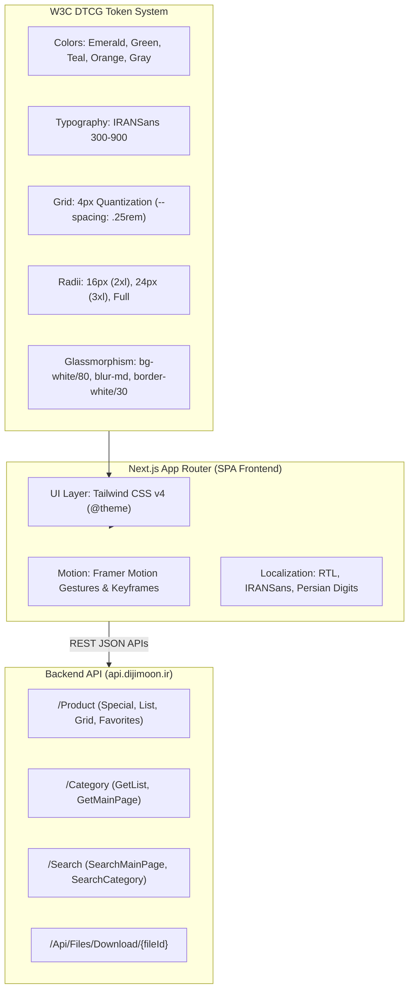
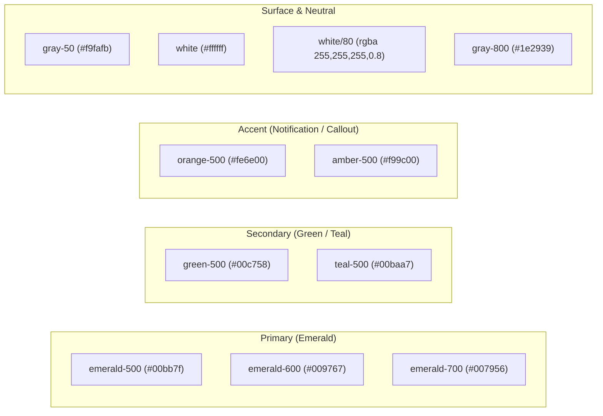
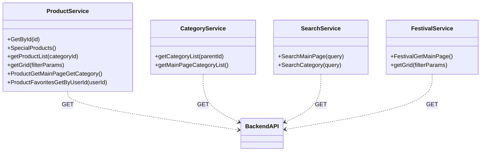

# Dijimoon (دیجی مون) Design System & Technical Specification

> **Target Site:** [https://dijimoon.ir](https://dijimoon.ir)  
> **Backend API:** `https://api.dijimoon.ir`  
> **Architecture:** Next.js (App Router, Turbopack) + Tailwind CSS v4 + Framer Motion + Lucide Icons  
> **Extraction Method:** Deconstructed from live SSR HTML trees, Tailwind v4 theme layers, and client-side chunks  
> **Specification Standard:** W3C DTCG (Design Tokens Community Group) compliant  

---

## 1. Executive Summary & System Architecture

Dijimoon is a mobile-first Iranian e-commerce Single Page Application (SPA) designed with a clean, modern aesthetic characterized by **frosted glassmorphism**, vibrant **emerald-to-teal gradients**, high-contrast **orange accent badges**, and fluid **Framer Motion interactions**.



### Key Technical Characteristics:
- **Styling Core**: Tailwind CSS v4 utilizing the new `@layer theme` and CSS custom property engine with native fallback to `lab()` high-gamut color space.
- **Micro-Interactions**: Custom `@keyframes floating` for attention badges, skeleton breathing pulses via `animate-pulse`, and bottom sheet drawer gestures via Framer Motion.
- **RTL & Typography**: Hardened for Right-to-Left (RTL) reading order, utilizing `IRANSans` with font-feature settings `"rlig" 1, "calt" 1` for accurate Persian script cursive glyph connection.
- **Network Environment**: Strict Iranian domestic IP enforcement on TLS handshakes; data layer utilizes REST JSON endpoints hosted on `https://api.dijimoon.ir`.

---

## 2. Visual Foundation & Design Tokens

### 2.1 Color Palette

The color system is organized into semantic tiers: **Brand Primary** (Emerald), **Brand Secondary** (Vibrant Green & Teal), **High-Visibility Accent** (Orange & Amber), **Neutral Grayscale** (Gray, Slate, Zinc), and **Surfaces**.



#### Color Tokens Reference Table

| Token Name | Hex Code | Lab Equivalent | Role / Application |
|---|---|---|---|
| `--color-emerald-50` | `#ecfdf5` | `lab(97.85% -6.95 1.85)` | Subtle tint, success backgrounds |
| `--color-emerald-400` | `#00d294` | `lab(75.08% -60.73 19.41)` | Input focus ring (`focus:ring-emerald-400`), active icons |
| `--color-emerald-500` | `#00bb7f` | `lab(66.98% -58.27 19.54)` | Core primary brand emerald |
| `--color-emerald-600` | `#009767` | `lab(55.05% -49.92 15.93)` | Primary action buttons, cart CTA, text gradient start |
| `--color-emerald-700` | `#007956` | `lab(44.49% -41.04 11.04)` | Button hover state (`hover:from-emerald-700`) |
| `--color-green-50` | `#f0fdf4` | `lab(98.16% -5.60 2.76)` | Selected address item background |
| `--color-green-500` | `#00c758` | `lab(70.55% -66.51 45.81)` | Brand logo gradient start, active borders |
| `--color-green-600` | `#00a544` | `lab(59.10% -58.66 41.26)` | Header icons, selection checkmarks |
| `--color-teal-500` | `#00baa7` | `lab(67.39% -49.10 -2.64)` | Brand logo gradient end, text gradient end |
| `--color-orange-500` | `#fe6e00` | `lab(64.27% 57.18 90.36)` | Floating cart item counter badge (`.cart-badge`) |
| `--color-gray-50` | `#f9fafb` | `lab(98.26% -0.25 -0.71)` | Body background (`bg-gray-50`) |
| `--color-gray-100` | `#f3f4f6` | `lab(96.16% -0.08 -1.14)` | Card borders, skeleton shimmer secondary |
| `--color-gray-200` | `#e5e7eb` | `lab(91.62% -0.16 -2.27)` | Skeleton placeholders, dividers, inactive borders |
| `--color-gray-400` | `#99a1af` | `lab(65.93% -0.83 -8.17)` | Icon color, secondary placeholder text |
| `--color-gray-500` | `#6a7282` | `lab(47.78% -0.39 -10.03)` | Inactive bottom navbar labels & icons |
| `--color-gray-600` | `#4a5565` | `lab(35.63% -1.59 -10.84)` | Address text, secondary content |
| `--color-gray-700` | `#364153` | `lab(27.11% -0.96 -12.32)` | Bottom navbar hover state |
| `--color-gray-800` | `#1e2939` | `lab(16.11% -1.18 -11.75)` | Primary typography, item headings |
| `--color-gray-900` | `#101828` | `lab(8.12% 0.81 -12.25)` | Display titles, dark elements |

#### Gradients

1. **Brand Logo Gradient**:
   ```css
   background: linear-gradient(to bottom right, #00c758, #00baa7);
   /* Tailwind: bg-linear-to-br from-green-500 to-teal-500 */
   ```
2. **Action Button Gradient**:
   ```css
   background: linear-gradient(to bottom right, #009767, #009767);
   /* Tailwind: bg-gradient-to-br from-emerald-600 to-emerald-600 hover:from-emerald-700 hover:to-emerald-700 */
   ```
3. **Persian Typography Gradient (`.gradient-text`)**:
   ```css
   background-image: linear-gradient(to right, #009767, #00baa7);
   -webkit-background-clip: text;
   background-clip: text;
   color: transparent;
   ```

---

### 2.2 Typography System

Dijimoon uses **IRANSans** as its foundational typeface, complemented by a complete scale of font weights and proportional line-height calculations optimized for the Persian Arabic script.

> [!IMPORTANT]
> In Persian digital typography, line heights must be proportionally taller than Latin scripts to prevent ascenders and descenders from overlapping with diacritical marks (dots, tashdid). Dijimoon enforces line-height calculations dynamically using `calc(line-height / font-size)`.

#### Font Weights
- `300` (Light) — Secondary captions, metadata
- `400` (Normal) — Subheadings, secondary addresses (`font-normal text-xs text-gray-500`)
- `500` (Medium) — Navigation labels, input text, primary address titles (`font-medium text-gray-800`)
- `600` (Semibold) — Product card titles, interactive modal items
- `700` (Bold) — Section titles, modal headers, badge counters
- `800` (Extrabold) — Price integers, key highlights
- `900` (Black) — Logo mark (`دیجی مون`), category display headings (`دسته‌بندی‌ها`)

#### Type Scale

| Size Class | Rem / Px | Line Height | Application |
|---|---|---|---|
| `text-xs` | `0.75rem` (12px) | `1.333` (`calc(1 / 0.75)`) | Bottom navbar text, cart count badge, address subtitle |
| `text-sm` | `0.875rem` (14px) | `1.428` (`calc(1.25 / 0.875)`) | Address selector main row, modal subtitle |
| `text-base` | `1rem` (16px) | `1.500` (`calc(1.5 / 1)`) | Default body copy, address items |
| `text-lg` | `1.125rem` (18px) | `1.555` (`calc(1.75 / 1.125)`) | Bottom sheet modal heading |
| `text-xl` | `1.25rem` (20px) | `1.400` (`calc(1.75 / 1.25)`) | Brand logo title, category header title |
| `text-2xl` | `1.5rem` (24px) | `1.333` (`calc(2 / 1.5)`) | Promoted product hero titles |
| `text-3xl` | `1.875rem` (30px) | `1.200` (`calc(2.25 / 1.875)`) | Promotional banners |
| `text-4xl` | `2.25rem` (36px) | `1.111` (`calc(2.5 / 2.25)`) | Hero landing banners |
| `text-5xl` | `3.00rem` (48px) | `1.000` | Numeric display metrics |

#### RTL & Persian Text Rules
```css
html[dir="rtl"] {
  direction: rtl;
  text-align: right;
}

body {
  font-family: "IRANSans", ui-sans-serif, system-ui, sans-serif;
  font-feature-settings: "rlig" 1, "calt" 1;
  -webkit-font-smoothing: antialiased;
  -moz-osx-font-smoothing: grayscale;
}
```

---

### 2.3 Spacing & 4px Quantization Grid

The spacing engine is built around a **4px base unit** (`--spacing: 0.25rem` in Tailwind v4). All paddings, margins, gaps, and skeleton heights snap to this grid.

```
0.25rem (4px)  ─── Base Unit
0.50rem (8px)  ─── p-2, space-x-2
0.75rem (12px) ─── p-3, py-3
1.00rem (16px) ─── p-4, px-4, gap-4 (Core Mobile Padding)
1.25rem (20px) ─── p-5
1.50rem (24px) ─── p-6 (Category Card Padding)
3.75rem (60px) ─── min-h-15 (Product Price Cluster)
6.25rem (100px)─── h-25 (Skeleton Image Slot)
```

#### Container Widths
- `container-sm`: `24rem` (384px)
- `container-md`: `28rem` (448px)
- `container-lg`: `32rem` (512px)
- `container-3xl`: `48rem` (768px)
- `container-4xl`: `56rem` (896px)
- `container-6xl`: `72rem` (1152px)
- Controls max width: `max-w-lg mx-auto` (512px centered search & address bars)

---

### 2.4 Radii & Border System

Dijimoon has an expressive rounded geometry designed to soften the visual presence of cards and touch controls:

| Token | CSS Value | Px Equivalent | Usage in Dijimoon |
|---|---|---|---|
| `--radius-lg` | `0.5rem` | 8px | Logo inner container (`rounded-lg`), pill tags |
| `--radius-xl` | `0.75rem` | 12px | Address cards, product image container (`rounded-xl`), back button |
| `--radius-2xl` | `1.0rem` | 16px | **Core Signature Radius**: Product cards, search input, cart button, skeletons |
| `--radius-3xl` | `1.5rem` | 24px | Category cards (`category-card`), hero banners (`rounded-3xl`), modal tops |
| `--radius-4xl` | `2.0rem` | 32px | Outer modal frames |
| `--radius-full` | `9999px` | Circular | Floating cart badge, circular control buttons, drawer pill |

---

### 2.5 Glassmorphism & Elevation System

Frosted glass is the primary visual motif unifying Dijimoon's chrome (sticky header, search bar, and fixed bottom navigation):

```css
/* Core Glassmorphism Spec */
.glass-effect {
  background-color: rgba(255, 255, 255, 0.8);
  backdrop-filter: blur(12px);
  -webkit-backdrop-filter: blur(12px);
  border-color: rgba(255, 255, 255, 0.3);
}

/* Dark Mode Adaptation */
.dark .glass-effect {
  background-color: rgba(24, 24, 27, 0.8);
  border-color: rgba(255, 255, 255, 0.1);
}
```

#### Elevation Tiers & Z-Index Layering

```
Z-240  ─── Bottom Sheet Modal & Backdrop Overlay (bg-black/50, backdrop-blur-sm)
Z-100  ─── Category Sticky Header (shadow-lg glass-effect)
Z-50   ─── Fixed Bottom Navigation Bar (#bottom-navbar, shadow-2xl)
Z-40   ─── Sticky Top Brand Header (header.sticky.top-0, shadow-xl)
Z-20   ─── Card Badges & Overlay Tags
Z-10   ─── Relative Card Content
Z-0    ─── Page Surface (bg-gray-50)
```

- **`shadow-md`**: Product cards (`product-card shadow-md border border-gray-100`)
- **`shadow-lg`**: Search input, cart button, address selector hover
- **`shadow-xl`**: Sticky top header, category cards
- **`shadow-2xl`**: Fixed bottom navbar (`shadow-2xl border-t border-white/30`), bottom sheet drawer

---

### 2.6 Micro-Animations

#### 1. Floating Cart Badge (`.cart-badge.floating`)
The cart notification counter features an eye-catching floating animation that gently bobs up and down:

```css
@keyframes floating {
  0%, 100% {
    transform: translateY(0px);
  }
  50% {
    transform: translateY(-4px);
  }
}

.floating {
  animation: floating 2s ease-in-out infinite;
}
```

#### 2. Skeleton Pulse
```css
@keyframes pulse {
  50% {
    opacity: 0.5;
  }
}
.animate-pulse {
  animation: pulse 2s cubic-bezier(0.4, 0, 0.6, 1) infinite;
}
```

---

## 3. Component Catalog & Implementation Guide

### 3.1 Sticky Brand Header
The header anchors the top of the mobile viewport, combining brand identity, address switcher, and cart launcher with full glassmorphic transparency.

```html
<header class="glass-effect sticky top-0 z-40 shadow-xl">
  <div class="px-4 py-4">
    <!-- Top Row: Brand & Cart -->
    <div class="flex items-center justify-between">
      <!-- Logo & Title -->
      <div class="flex items-center space-x-3">
        <!-- Logo Gradient Frame -->
        <div class="rounded-2xl bg-linear-to-br from-green-500 to-teal-500 p-1 text-white">
          <div class="w-10 h-10 relative rounded-lg overflow-hidden bg-white/20 flex items-center justify-center backdrop-blur-sm">
            
          </div>
        </div>
        <div>
          <h1 class="gradient-text text-xl font-black">دیجی مون</h1>
        </div>
      </div>

      <!-- Cart Button with Floating Badge -->
      <div class="flex items-center space-x-3">
        <a href="/cart">
          <button class="relative rounded-2xl bg-gradient-to-br from-emerald-600 to-emerald-600 p-3 text-white shadow-lg transition-all hover:from-emerald-700 hover:to-emerald-700">
            <!-- Lucide Shopping Cart Icon -->
            <svg class="h-5 w-5" fill="currentColor" viewBox="0 0 20 20">
              <path d="M3 1a1 1 0 000 2h1.22l.305 1.222a.997.997 0 00.01.042l1.358 5.43-.893.892C3.74 11.846 4.632 14 6.414 14H15a1 1 0 000-2H6.414l1-1H14a1 1 0 00.894-.553l3-6A1 1 0 0017 3H6.28l-.31-1.243A1 1 0 005 1H3zM16 16.5a1.5 1.5 0 11-3 0 1.5 1.5 0 013 0zM6.5 18a1.5 1.5 0 100-3 1.5 1.5 0 000 3z"/>
            </svg>
            <!-- Floating Counter Badge -->
            <span class="cart-badge absolute -left-2 -top-2 flex h-6 w-6 items-center justify-center rounded-full bg-orange-500 text-xs font-bold text-white floating">
              3
            </span>
          </button>
        </a>
      </div>
    </div>

    <!-- Bottom Row: Address Selector Bar -->
    <div class="mt-3">
      <button class="flex items-center space-x-2 text-sm text-gray-600 transition-colors hover:text-emerald-600">
        <!-- Location Pin Icon -->
        <svg class="h-6 w-6 text-gray-400" fill="currentColor" viewBox="0 0 20 20">
          <path fill-rule="evenodd" d="M5.05 4.05a7 7 0 119.9 9.9L10 18.9l-4.95-4.95a7 7 0 010-9.9zM10 11a2 2 0 100-4 2 2 0 000 4z"/>
        </svg>
        <div class="flex flex-col items-start gap-1 ml-2 min-w-30">
          <span class="font-medium text-gray-800 line-clamp-1">آدرس شما</span>
          <span class="font-normal text-xs text-gray-500 line-clamp-1">آدرس را انتخاب کنید</span>
        </div>
        <!-- Chevron Icon -->
        <svg class="h-6 w-6 text-gray-400" fill="currentColor" viewBox="0 0 20 20">
          <path fill-rule="evenodd" d="M5.293 7.293a1 1 0 011.414 0L10 10.586l3.293-3.293a1 1 0 111.414 1.414l-4 4a1 1 0 01-1.414 0l-4-4a1 1 0 010-1.414z"/>
        </svg>
      </button>
    </div>
  </div>
</header>
```

---

### 3.2 Search Input Bar
A prominent, rounded floating input bar with glass blur and emerald accent highlights:

```html
<section class="px-4 py-4">
  <div class="relative w-full max-w-lg mx-auto">
    <div class="relative group">
      <input
        type="text"
        placeholder="جستجو در دیجی مون..."
        class="glass-effect w-full rounded-2xl px-4 py-4 pr-12 font-medium shadow-lg transition-all focus:outline-none focus:ring-2 focus:ring-emerald-400 bg-white/80 backdrop-blur-md"
      />
      <div class="absolute right-4 top-1/2 -translate-y-1/2">
        <svg class="h-6 w-6 text-emerald-400" fill="none" stroke="currentColor" viewBox="0 0 24 24">
          <path stroke-linecap="round" stroke-linejoin="round" stroke-width="2" d="M21 21l-6-6m2-5a7 7 0 11-14 0 7 7 0 0114 0z" />
        </svg>
      </div>
    </div>
  </div>
</section>
```

---

### 3.3 Responsive Product Card Grid & Card Architecture

#### Responsive Breakpoints
```html
<div class="p-4 grid grid-cols-2 md:grid-cols-3 lg:grid-cols-4 xl:grid-cols-5 gap-4">
  <!-- Product Cards -->
</div>
```

#### Product Card Component
```html
<div class="product-card rounded-2xl shadow-md overflow-hidden bg-white border border-gray-100 w-full shrink-0 flex flex-col">
  <div class="p-4 text-center">
    <!-- Image Slot with Discount Pill -->
    <div class="relative h-40 w-full mb-3 flex justify-center items-center bg-gray-50 rounded-xl overflow-hidden">
      <!-- Discount Badge -->
      <div class="absolute top-0 inset-x-0 z-20 flex justify-between items-start p-2 w-full">
        <span class="rounded-lg bg-red-500 text-white text-xs font-bold px-2 py-0.5">۲۰٪</span>
        <span class="rounded-lg bg-emerald-100 text-emerald-700 text-xs font-medium px-2 py-0.5 ml-auto">ارسال فوری</span>
      </div>
      
    </div>

    <!-- Title & Brand -->
    <div class="space-y-2 mb-2">
      <h3 class="font-semibold text-gray-800 text-sm line-clamp-2">عنوان محصول دیجی مون</h3>
      <p class="text-xs text-gray-400">دسته‌بندی محصول</p>
    </div>

    <!-- Price Cluster -->
    <div class="flex flex-col items-center justify-center min-h-15 space-y-1">
      <span class="text-xs text-gray-400 line-through">۱۵۰,۰۰۰ تومان</span>
      <span class="text-base font-bold text-gray-900">۱۲۰,۰۰۰ تومان</span>
    </div>
  </div>

  <!-- Add to Cart Action -->
  <div class="px-4 pb-4 mt-auto">
    <button class="h-12 bg-gradient-to-r from-emerald-600 to-teal-500 hover:from-emerald-700 hover:to-teal-600 text-white font-medium rounded-2xl w-full transition-all shadow-md active:scale-95">
      افزودن به سبد خرید
    </button>
  </div>
</div>
```

---

### 3.4 Product Card Skeleton Loader
Matches exact dimensions to prevent Layout Shift (CLS = 0) during API hydration:

```html
<div class="product-card rounded-2xl shadow-md overflow-hidden bg-white border border-gray-100 w-full shrink-0 animate-pulse">
  <div class="p-4 text-center">
    <!-- Image Skeleton -->
    <div class="relative h-40 w-full mb-3 flex justify-center items-center bg-gray-200 rounded-xl">
      <div class="absolute top-0 inset-x-0 z-20 flex justify-between items-start p-2 w-full">
        <div class="h-5 w-10 bg-gray-300 rounded-lg"></div>
        <div class="h-5 w-12 bg-gray-300 rounded-lg ml-auto"></div>
      </div>
    </div>
    <!-- Title Skeleton -->
    <div class="space-y-2 mb-2">
      <div class="h-4 bg-gray-200 rounded w-full mx-auto"></div>
      <div class="h-4 bg-gray-200 rounded w-2/3 mx-auto"></div>
    </div>
    <!-- Price Skeleton -->
    <div class="flex flex-col items-center justify-center min-h-15 space-y-1">
      <div class="h-3 bg-gray-100 rounded w-1/3"></div>
      <div class="h-6 bg-gray-200 rounded w-1/2"></div>
    </div>
  </div>
  <!-- Button Skeleton -->
  <div class="px-4 pb-4 mt-auto">
    <div class="h-12 bg-gray-200 rounded-2xl w-full"></div>
  </div>
</div>
```

---

### 3.5 Fixed Bottom Navigation Bar (`#bottom-navbar`)
Fixed to the bottom of the viewport with top glassmorphic border and high z-index:

```html
<nav id="bottom-navbar" class="glass-effect fixed bottom-0 left-0 right-0 z-50 border-t border-white/30 shadow-2xl">
  <div class="flex items-center justify-around">
    <!-- Products -->
    <a href="/product" class="flex flex-1 flex-col items-center gap-1 py-3 transition-all duration-200 text-gray-500 hover:text-gray-700">
      <svg class="h-6 w-6 lucide lucide-package-search" fill="none" stroke="currentColor" stroke-width="2" viewBox="0 0 24 24">
        <path d="M21 10V8a2 2 0 0 0-1-1.73l-7-4a2 2 0 0 0-2 0l-7 4A2 2 0 0 0 3 8v8a2 2 0 0 0 1 1.73l7 4a2 2 0 0 0 2 0l2-1.14" />
        <path d="m7.5 4.27 9 5.15" />
        <polyline points="3.29 7 12 12 20.71 7" />
        <line x1="12" x2="12" y1="22" y2="12" />
        <circle cx="18.5" cy="15.5" r="2.5" />
        <path d="M20.27 17.27 22 19" />
      </svg>
      <span class="text-xs font-medium">محصولات</span>
    </a>

    <!-- Categories -->
    <a href="/categories" class="flex flex-1 flex-col items-center gap-1 py-3 transition-all duration-200 text-gray-500 hover:text-gray-700">
      <svg class="h-6 w-6 lucide lucide-layout-grid" fill="none" stroke="currentColor" stroke-width="2" viewBox="0 0 24 24">
        <rect width="7" height="7" x="3" y="3" rx="1" />
        <rect width="7" height="7" x="14" y="3" rx="1" />
        <rect width="7" height="7" x="14" y="14" rx="1" />
        <rect width="7" height="7" x="3" y="14" rx="1" />
      </svg>
      <span class="text-xs font-medium">دسته‌بندی‌ها</span>
    </a>

    <!-- Cart -->
    <a href="/cart" class="flex flex-1 flex-col items-center gap-1 py-3 transition-all duration-200 text-gray-500 hover:text-gray-700">
      <svg class="h-6 w-6 lucide lucide-shopping-cart" fill="none" stroke="currentColor" stroke-width="2" viewBox="0 0 24 24">
        <circle cx="8" cy="21" r="1" />
        <circle cx="19" cy="21" r="1" />
        <path d="M2.05 2.05h2l2.66 12.42a2 2 0 0 0 2 1.58h9.78a2 2 0 0 0 1.95-1.57l1.65-7.43H5.12" />
      </svg>
      <span class="text-xs font-medium">سبد خرید</span>
    </a>

    <!-- Home -->
    <a href="/" class="flex flex-1 flex-col items-center gap-1 py-3 transition-all duration-200 text-emerald-600">
      <svg class="h-6 w-6 lucide lucide-home" fill="none" stroke="currentColor" stroke-width="2" viewBox="0 0 24 24">
        <path d="m3 9 9-7 9 7v11a2 2 0 0 1-2 2H5a2 2 0 0 1-2-2z" />
        <polyline points="9 22 9 12 15 12 15 22" />
      </svg>
      <span class="text-xs font-medium">خانه</span>
    </a>
  </div>
</nav>
```

---

### 3.6 Category Header with Back Button
Used on secondary exploration screens:

```html
<div class="flex sticky top-0 items-center justify-between shadow-lg glass-effect bg-white z-100">
  <div class="md:p-4 flex items-center">
    <button class="ml-3 p-2 hover:bg-white/50 rounded-xl transition-colors">
      <!-- Chevron Right (in RTL, points back) -->
      <svg class="w-6 h-6 text-green-600" fill="currentColor" viewBox="0 0 20 20">
        <path fill-rule="evenodd" d="M7.293 14.707a1 1 0 010-1.414L10.586 10 7.293 6.707a1 1 0 011.414-1.414l4 4a1 1 0 010 1.414l-4 4a1 1 0 01-1.414 0z"/>
      </svg>
    </button>
    <h2 class="text-xl font-black gradient-text">دسته‌بندی‌ها</h2>
  </div>
  <div class="p-4">
    <a href="/cart">
      <button class="relative rounded-2xl bg-gradient-to-br from-emerald-600 to-emerald-600 p-3 text-white shadow-lg transition-all hover:from-emerald-700 hover:to-emerald-700">
        <svg class="h-5 w-5" fill="currentColor" viewBox="0 0 20 20">
          <path d="M3 1a1 1 0 000 2h1.22l.305 1.222a.997.997 0 00.01.042l1.358 5.43-.893.892C3.74 11.846 4.632 14 6.414 14H15a1 1 0 000-2H6.414l1-1H14a1 1 0 00.894-.553l3-6A1 1 0 0017 3H6.28l-.31-1.243A1 1 0 005 1H3zM16 16.5a1.5 1.5 0 11-3 0 1.5 1.5 0 013 0zM6.5 18a1.5 1.5 0 100-3 1.5 1.5 0 000 3z"/>
        </svg>
        <span class="cart-badge absolute -left-2 -top-2 flex h-6 w-6 items-center justify-center rounded-full bg-orange-500 text-xs font-bold text-white floating">…</span>
      </button>
    </a>
  </div>
</div>
```

---

### 3.7 Address Selection Bottom Sheet / Modal (Framer Motion)

```html
<!-- Backdrop Overlay -->
<div class="fixed inset-0 bg-black/50 backdrop-blur-sm z-240 transition-opacity"></div>

<!-- Bottom Sheet Container -->
<div class="fixed inset-x-0 bottom-0 z-240 bg-white dark:bg-zinc-900 rounded-t-3xl shadow-2xl p-6 max-w-lg mx-auto">
  <!-- Draggable Handle Indicator -->
  <div class="relative pb-4 mb-4 border-b border-slate-100 dark:border-zinc-800 select-none flex flex-col items-center touch-none cursor-grab active:cursor-grabbing">
    <div class="w-12 h-1.5 bg-slate-200 dark:bg-zinc-700 rounded-full mb-3"></div>
    <div class="flex flex-col items-center px-10 text-center w-full">
      <h3 class="text-lg font-bold text-slate-800 dark:text-zinc-100">انتخاب آدرس تحویل</h3>
      <p class="mt-1 text-sm text-slate-500">سفارش شما به آدرس انتخاب شده ارسال خواهد شد</p>
    </div>
    <!-- Close Button -->
    <button type="button" class="absolute top-0 right-0 p-1.5 text-slate-400 hover:text-slate-700 rounded-full">
      <svg class="w-5 h-5" fill="none" stroke="currentColor" viewBox="0 0 24 24">
        <path stroke-linecap="round" stroke-linejoin="round" stroke-width="2" d="M6 18L18 6M6 6l12 12" />
      </svg>
    </button>
  </div>

  <!-- Scrollable Address List -->
  <div class="flex-1 overflow-y-auto text-slate-700 dark:text-zinc-300 space-y-3 max-h-80 pr-1">
    <!-- Active Selected Item -->
    <div class="flex justify-between items-center border rounded-xl p-4 transition-all cursor-pointer border-green-500 bg-green-50">
      <div class="flex-1 mr-2">
        <div class="flex items-center justify-between mb-1">
          <span class="font-semibold text-gray-800 md:text-sm text-base">منزل</span>
        </div>
        <p class="md:text-xs text-sm text-gray-600 leading-6">تهران، خیابان آزادی، پلاک ۱۲، واحد ۴</p>
      </div>
      <div class="flex flex-col items-center gap-2">
        <!-- Edit & Delete actions -->
      </div>
    </div>

    <!-- Inactive Item -->
    <div class="flex justify-between items-center border rounded-xl p-4 transition-all cursor-pointer border-gray-200 hover:border-green-300">
      <div class="flex-1 mr-2">
        <div class="flex items-center justify-between mb-1">
          <span class="font-semibold text-gray-800 md:text-sm text-base">محل کار</span>
        </div>
        <p class="md:text-xs text-sm text-gray-600 leading-6">تهران، میدان ونک، برج نگار، طبقه ۵</p>
      </div>
    </div>
  </div>
</div>
```

---

## 4. Reverse-Engineered Internal REST API

Direct inspection of production client chunks reveals the following internal API service layer:

- **Base URL**: `https://api.dijimoon.ir`
- **Static Assets CDN**: `https://api.dijimoon.ir/Api/Files/Download/{fileId}`



### Endpoints Inventory:

| Service | Method | Route Pattern | Purpose |
|---|---|---|---|
| **Product** | GET | `/Product/{id}` | Single product detail |
| **Product** | GET | `/Product/SpecialProducts` | Discounted / featured products slider |
| **Product** | GET | `/Product/GetList/{id?}` | List products under category |
| **Product** | POST | `/Product/GetGrid` | Paginated, filtered product grid |
| **Product** | GET | `/Product/ProductGetMainPageGetCategory` | Main landing category product rails |
| **Product** | GET | `/Product/ProductFavoritesGetByUserId/{userId}` | User bookmarked products |
| **Category** | GET | `/Category/GetList/{parentId?}` | Tree/list of product categories |
| **Category** | GET | `/Category/GetMainPage` | Homepage category shortcut icons |
| **Search** | GET | `/Search/SearchMainPage/{query}` | Global product and catalog search |
| **Search** | GET | `/Search/SearchCategory/{query}` | Search scoped to categories |
| **Festival** | GET | `/Festival/GetFestival` | Active promotional marketing campaign |
| **Festival** | POST | `/Festival` | Campaign product grid |
| **Files** | GET | `/Api/Files/Download/{fileId}` | CDN image asset retrieval |

---

## 5. Integration & Usage Guidelines

### 5.1 Using Tailwind CSS v4
Include the generated `tailwind-theme.css` in your project's global stylesheet:
```css
/* app/globals.css */
@import "./design-system/tailwind-theme.css";
```

### 5.2 Using Tailwind CSS v3
Copy `design-system/tailwind.config.js` to your root directory or merge into your existing `tailwind.config.js`:
```javascript
const dijimoonConfig = require("./design-system/tailwind.config.js");
module.exports = {
  ...dijimoonConfig,
};
```

### 5.3 Persian / RTL Typography Setup in Next.js
In your root layout (`app/layout.tsx`):
```tsx
import type { Metadata } from "next";
import localFont from "next/font/local";
import "./globals.css";

const iranSans = localFont({
  src: [
    { path: "../public/fonts/IRANSansWeb_Light.woff2", weight: "300" },
    { path: "../public/fonts/IRANSansWeb.woff2", weight: "400" },
    { path: "../public/fonts/IRANSansWeb_Medium.woff2", weight: "500" },
    { path: "../public/fonts/IRANSansWeb_Bold.woff2", weight: "700" },
    { path: "../public/fonts/IRANSansWeb_Black.woff2", weight: "900" },
  ],
  variable: "--font-iransans",
  display: "swap",
});

export const metadata: Metadata = {
  title: "دیجی مون | فروشگاه آنلاین",
  description: "با دیجی‌مون هوشمند خرید کن",
};

export default function RootLayout({ children }: { children: React.ReactNode }) {
  return (
    <html lang="fa" dir="rtl">
      <body className={`${iranSans.className} antialiased bg-gray-50 text-gray-800`}>
        {children}
      </body>
    </html>
  );
}
```

---

## 6. Deliverables Index

All extracted deliverables are generated and organized within the workspace:

1. **W3C DTCG Design Tokens JSON**: [`design-system/tokens.json`](file:///Users/amirheidari/GitHub/Digi-Moon/design-system/tokens.json)
2. **Tailwind CSS v4 Theme (`@theme`)**: [`design-system/tailwind-theme.css`](file:///Users/amirheidari/GitHub/Digi-Moon/design-system/tailwind-theme.css)
3. **Tailwind CSS v3 Configuration**: [`design-system/tailwind.config.js`](file:///Users/amirheidari/GitHub/Digi-Moon/design-system/tailwind.config.js)
4. **Comprehensive System Specification**: [`design-system/DESIGN_SYSTEM.md`](file:///Users/amirheidari/GitHub/Digi-Moon/design-system/DESIGN_SYSTEM.md)
5. **Interactive Live Showcase**: [`design-system/index.html`](file:///Users/amirheidari/GitHub/Digi-Moon/design-system/index.html)
6. **React Component Library**: [`design-system/components/`](file:///Users/amirheidari/GitHub/Digi-Moon/design-system/components/)
7. **Typed Domain Models & API Client**: [`design-system/lib/api.ts`](file:///Users/amirheidari/GitHub/Digi-Moon/design-system/lib/api.ts) & [`design-system/types/`](file:///Users/amirheidari/GitHub/Digi-Moon/design-system/types/)

---

## 7. Deep Verification, SSO Authentication & Adaptive Architecture Findings

Through deep inspection of production Turbopack bundles (`00e0smicu1cf0.js`, `01l8tg0cagalm.js`, `0hj6cqd1ylhow.js`), additional critical subsystems were uncovered and verified:

### 7.1 The 580px Responsive Adaptive Drawer / Modal Pattern
Dijimoon does not use distinct mobile and desktop dialogs; instead, it uses a unified adaptive container governed by a strict `580px` viewport threshold:
- **Mobile (`< 580px`)**:
  - Anchors to the bottom of the viewport with `rounded-t-2xl`.
  - Automatically reads the DOM height of `#bottom-navbar` and offsets bottom positioning accordingly (`bottom: ${bottomNav.offsetHeight}px`).
  - Supports vertical dragging gestures (`drag="y"`) powered by Framer Motion with spring physics (`stiffness: 300, damping: 30`). Dragging downward > 100px triggers dismissal.
  - Safe area inset padding: `paddingBottom: calc(env(safe-area-inset-bottom) + 1rem)`.
- **Desktop (`>= 580px`)**:
  - Transforms into a floating centered dialog (`left-1/2 top-1/2 -translate-x-1/2 -translate-y-1/2`).
  - Constrained to `maxWidth: 500px` and `maxHeight: 85vh` with full `rounded-2xl` corners.
  - Dragging gestures are deactivated.

### 7.2 SSO & Phone TOTP Authentication Flow
The identity provider is integrated via a lightweight REST SSO service:
```typescript
interface AuthService {
  requestTotp(data: { PhoneNumber: string }): Promise<void>;
  reSendTotp(data: { PhoneNumber: string }): Promise<void>;
  verifyTotp(data: { PhoneNumber: string; Code: string }): Promise<{
    IsExistUser: boolean;
    AccessToken: string;
    RefreshToken: string;
  }>;
  register(data: any): Promise<any>;
}
```
- **Phone Validation Rules**: Enforced via Yup/Zod:
  - Required message: `"شماره تماس الزامی است"`
  - Length constraint: Must be exactly 11 digits starting with `09` (`"شماره تماس باید ۱۱ رقم باشد"`).
- **Session Tokens**: JWT `AccessToken` and `RefreshToken` managed via `TokenService`.

### 7.3 The Dual Theming Strategy: Slate (Light) vs Zinc (Dark)
The production code reveals an intentional contrast pairing for dark mode:
- **Light Theme (Slate Neutral)**:
  - Surface: `#ffffff` / `slate-50`
  - Borders: `border-slate-100` (`#f1f5f9`)
  - Drag handle: `bg-slate-200` (`#e2e8f0`)
  - Secondary text: `text-slate-500` (`#62748e`)
  - Headings: `text-slate-800` (`#1d293d`)
- **Dark Theme (Zinc Neutral)**:
  - Surface: `dark:bg-zinc-900` (`#18181b`)
  - Borders: `dark:border-zinc-800` (`#27272a`)
  - Drag handle: `dark:bg-zinc-700` (`#3f3f46`)
  - Secondary text: `dark:text-zinc-400` (`#a1a1aa`)
  - Headings: `dark:text-zinc-100` (`#f4f4f5`)

### 7.4 Festival & Campaign System (`🎉 شگفتانه`)
- Route `/product/festival` hosts time-limited discount campaigns.
- Hero callout uses an expressive emoji icon in a gradient tile (`bg-gradient-to-br from-red-500 to-pink-500 rounded-2xl`).
- Catalog items in festivals are decorated with a gold-to-orange gradient badge (`bg-gradient-to-r from-amber-500 to-orange-500 text-white font-bold`).
